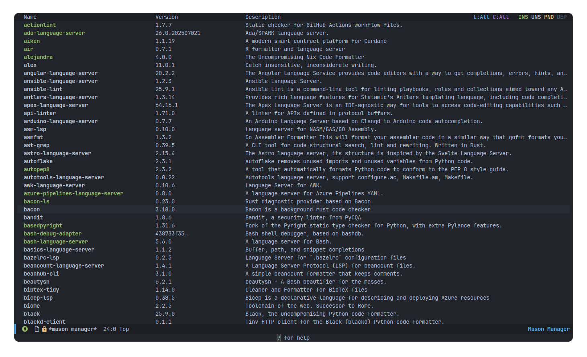
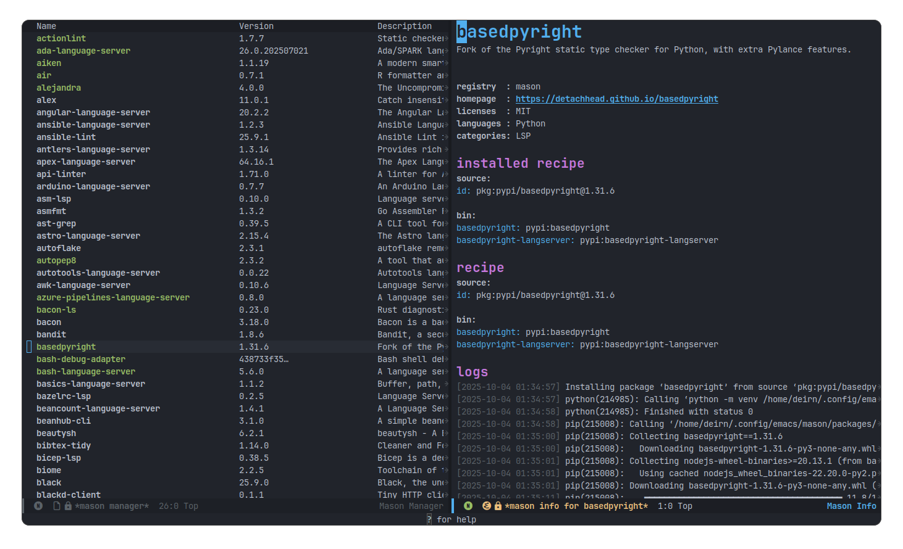
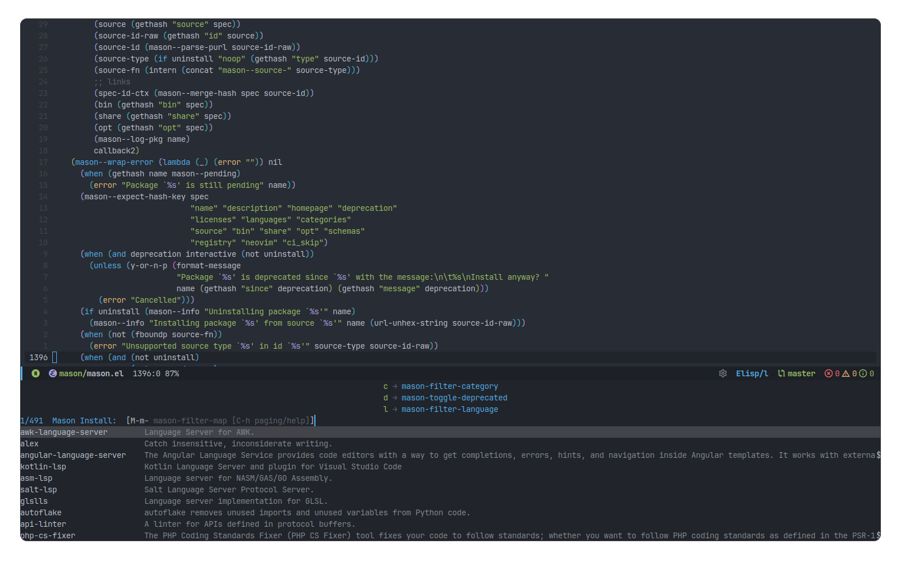

# mason.el [](https://melpa.org/#/mason)

mason.el is installer for LSP servers, DAP servers, linters and formatters,
inspired by [mason.nvim](https://github.com/mason-org/mason.nvim).

Package registry at [mason-org/mason-registry](https://github.com/mason-org/mason-registry).

- Run `M-x mason-install RET` to install packages.
- Run `M-x mason-manager RET` to open package manager.

## Installation
mason.el is available in [MELPA](https://melpa.org/#/mason), install it in your favorite way
and call `(mason-ensure)` to setup the environment.

### Install it with `use-package`
``` emacs-lisp
(use-package mason
  :ensure t
  :config
  (mason-ensure)
  ;; or
  :hook
  (after-init-hook . mason-ensure))
```

## Screenshots
|                                             |                                           |
|:-------------------------------------------:|:-----------------------------------------:|
|      |     |
| `mason-manager`                             | Package info                              |
|  |  |
| `mason-install`                             | `mason-log`                               |
|                                             |                                           |
