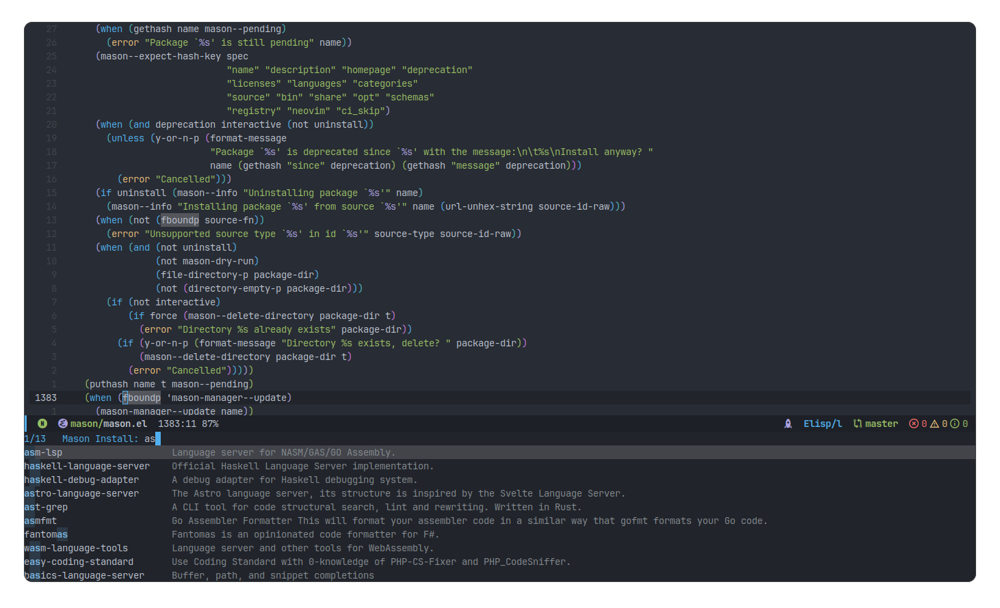

# mason.el [](https://melpa.org/#/mason)

mason.el is installer for LSP servers, DAP servers, linters and formatters,
inspired by [mason.nvim](https://github.com/mason-org/mason.nvim).

Package registry at [mason-org/mason-registry](https://github.com/mason-org/mason-registry).

- `M-x mason-install RET` to install packages.
- `M-x mason-manager RET` to open package manager.

## Screenshots
|                                             |                                           |
|:-------------------------------------------:|:-----------------------------------------:|
|      |     |
| `mason-manager`                             | Package info                              |
|  |  |
| `mason-install`                             | `mason-log`                               |
|                                             |                                           |

## Requirements
mason.el will call external programs such as `cargo` and `npm` to install the packages,
or `tar` and `gzip` to extract downloaded archives.

Call `(mason-doctor)` to see the requirements of each package type.

## Installation
mason.el is available on [MELPA](https://melpa.org/#/mason), install it in your favorite way
and call `(mason-setup)` to setup the environment.

### Install it with `use-package`
``` emacs-lisp
(use-package mason
  :ensure t
  :config
  (mason-setup))
```

### Install it in [Doom Emacs](https://github.com/doomemacs/doomemacs):
Add to `DOOMDIR/packages.el`:
``` emacs-lisp
(package! mason)
```

Add to `DOOMDIR/config.el`:
``` emacs-lisp
(use-package! mason
  :config
  (mason-setup))
```

## Snippets

### Programmatically installing packages
mason.el can be used to install packages programmatically:
``` emacs-lisp
(mason-setup
  (dolist (pkg '("basedpyright" "jdtls" "clangd"))
    (unless (mason-installed-p pkg)
      (ignore-errors (mason-install pkg)))))
```
This will (try to) install the missing packages.
